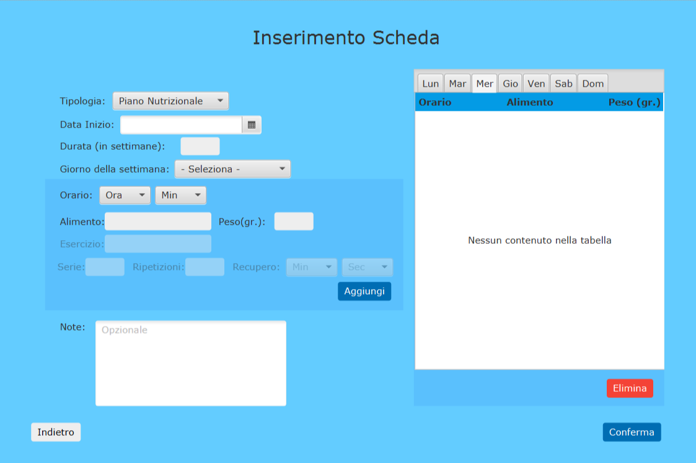

# SmartTraining

**SmartTraining** is a Java based desktop application that provides useful interfaces to improve communication between personal trainers and customers.

We provide an [extended documentation](https://github.com/Lostefra/SmartTraining/blob/master/res/Smart%20Training.pdf) of the project and a brief [introductory presentation](https://github.com/Lostefra/SmartTraining/blob/master/res/Smart%20training%20-%20Presentazione.pdf) as well.

This project was developed as part of the *Software Engineering* university course (Bachelor in Computer Engineering, Alma Mater Studiorum - University of Bologna).

### Authors

* [Lorenzo Mario Amorosa](https://github.com/Lostefra)
* [Parsa Dahesh](https://github.com/ParsaD23)
* [Davide D'Ambrosio](https://github.com/Dambrix)

### Use cases

Customers can access several interfaces from their home page, for example they can:
* Make requests to personal trainers
* See their own training schedule
* Buy gym's product

Personal trainers have access to all existing training schedule and are can respond to customers' requests.

The application natively support login mechanism, email notification for each relevant action and logging.

### View examples

##### Customer Home Page

##### Customer Request Page

##### Customer Training Schedule Page

##### Personal Training Schedule Page

